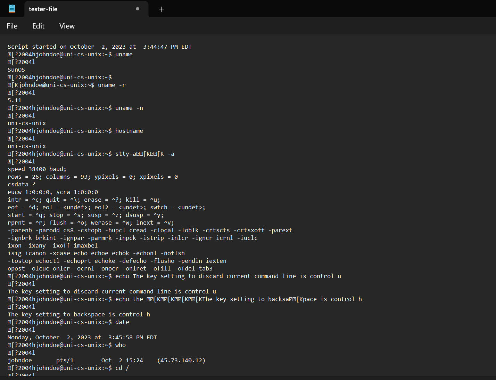
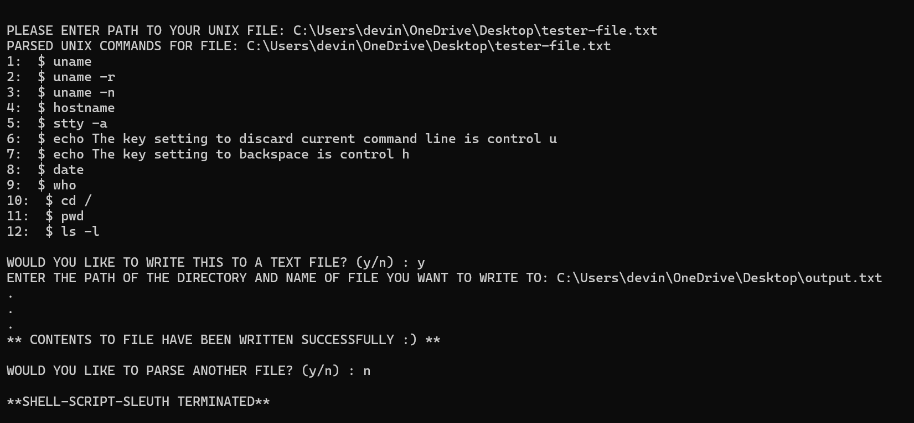

# ShellScriptSleuth

## Introduction
ShellScriptSleuth is a tool designed to efficiently parse and extract command-line entries from Unix shell logs. This project was born out of a real-world need encountered while assisting students in an operating systems class at our university. As instructors and TAs often need to review logged shell sessions to verify and understand student commands, this tool automates and simplifies the process by extracting the essential command data from verbose script logs.

## Motivation
During my time helping students with their assignments in the operating systems course, I found myself frequently navigating through extensive shell script logs. These files captured complete interactive sessions hosted on the university's Unix server, containing not just the commands but also outputs and miscellaneous terminal interactions. This made the review process time-consuming and cumbersome, as distinguishing relevant command inputs from outputs and system messages was manually intensive.

## Outputs

### Raw Unix File

### Parsed Unix Commands File

### Program Process

