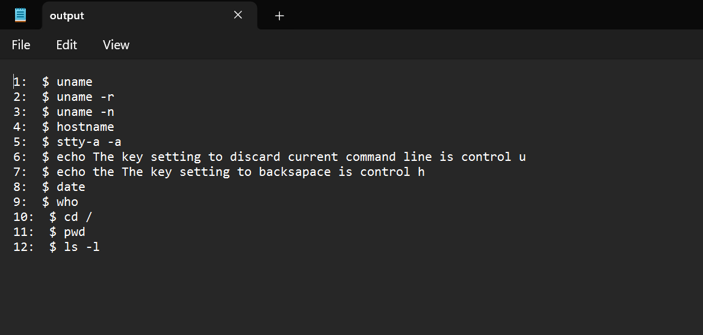

# ShellScriptSleuth

## Introduction
**ShellScriptSleuth** is a specialized tool developed to parse and extract command-line entries from Unix shell logs efficiently. This utility addresses the real-world challenges faced by instructors and teaching assistants who review logged shell sessions to verify and understand student commands in operating systems courses.

## Motivation
My experience assisting students in an operating systems course highlighted the inefficiencies in navigating extensive shell script logs. These logs, captured on the university's Unix server, include not only the commands but also the outputs and other terminal interactions. Reviewing these logs to distinguish relevant command inputs from outputs and system messages was both time-consuming and manually intensive. **ShellScriptSleuth** automates this process, streamlining the extraction of essential command data and significantly reducing manual effort.

## Outputs
**ShellScriptSleuth** provides clear and concise outputs, transforming verbose script logs into easily reviewable command entries. Below are examples of the outputs generated by ShellScriptSleuth:

### Raw Unix File

### Parsed Unix Commands File (Generated via Java FileWriter)

### Program Process

